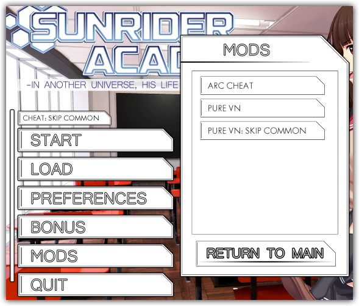

# Sunrider Academy Mod Interface

A fork of Neppi's mod (with no repo). Contains UI improvements and improved mod compatibility support.

The original [Mod Interface Forum Post can be found here](http://forum.loveinspace.moe/thread/625/sunrider-academy-mod-interface).

<p align="center"></p>

***

<br/>

## Current Mod Interface API

Any interactions with the `ac_mod` store variable must be called at `init -199` or higher.

### Test if Mod Interface is Installed

```renpy
init python:
    if hasattr(store,'ac_mod'):
        ac_mod.register_main_button(text="My Mod",action=Start("mymod_start"),verion="v1.0.1.2")
    elif hasattr(store,'ac_mod_button_list'):
        # If the store has this variable but does not have 'ac_mod',
        # then we are running the old Mod Interface version.
        ac_mod_button_list.append(["mods/mymod/button_base.png","mods/mymod/button_hover.png","mymod_start",False,False])
    else:
        # Mod Interface is not Installed, whether you want your
        # mod to function without it is up to you.
        pass
```

### Add a Button to the Main Menu Mod List

```renpy
init python:
    # * text is the label that will display on the button.
    # * action is the action performed when the button is pressed.
    # * condition in this case specifies that the label 'credits' has
    #   been encountered in order to see the button in the list. This
    #   is a string beacuse it is evalulated at runtime.
    # * hide_list specifies that the mods list screen is hidden when
    #   the button is pressed.
    # * version is not required
    ac_mod.register_main_button(text="My Mod Screen",action=Show("mymod_screen"),condition="renpy.seen_label('credits')",hide_list=True,version="v2.0.0.0")
```

Alternatively, you can list your button as an image like in the old interface. Both text and button images can be passed. If done so, both will be drawn.

```renpy
init python:
    # * idle_image is the default image shown for the button.
    # * hover_image is the image shown for the button when the mouse is over it.
    ac_mod.register_main_button(idle_image="mods/mymod/button_base.png",hover_image="mods/mymod/button_hover.png",action=Start("mymod_start"))
```

### Mod Button Example Actions

Calling Start will automatically hide all screens, so hide_list is unnecessary.

```renpy
Start("label_name")  # to start a game at label
Show("screen_name")  # to show a screen
Function(func_name)  # to call a function
```

### Label Callback

The new Mod Interface API allows you to add your own hook into the `config.label_callback` function.

You cannot use `renpy.call(label)` within the `label_callback`, it will fail or cause undefined behavior. Call `renpy.jump(label)` if you need to go to another label. Any label jumped to from within the `label_callback` can use `call` normally.

```renpy
init python:
    def mymod_label_callback(label,abnormal):
        # In Sunrider Academy, the class_selection label is never
        # jumped to or called. Instead the control flow walks in
        # from the previous label.
        
        # Make sure you do not perform any action in this callback
        # unless your mod is enabled.
        if label == "class_selection" and mymod_enabled == True:
            renpy.jump("mymod_class_selection")
    
    # Whenever a label is reached, this function will be called.
    # Functions registered in earlier init blocks will be called first
    ac_mod.register_label_callback(mymod_label_callback)
```

### Handling Label Callback with any version of Mod Interface

If you plan for your mod to support being run with or without Mod Interface, then use this as an example for how your label callback should be executed.

```renpy
init 2 python:
    # Set to false to disable all custom interaction in purevn_label_callback().
    # We will enable this when the user selects our mod from the Mod List.
    purevn_label_callback_enabled = not hasattr(store,'ac_mod') and not hasattr(store,'ac_mod_button_list')

    def purevn_label_callback(label,abnormal):
        # Make sure to call the original label callback too,
        # but only if it's not handled by the new Mod Interface.
        # (The old mod interface does not support label_callback)
        if not hasattr(store,'ac_mod'):
            purevn_original_label_callback(label,abnormal)

        if purevn_label_callback_enabled == False:
            return

        if not hasattr(store,'purevn') or purevn.enabled == False:
            # Manually ask the user to start PureVN if Mod Interface is not present.
            if label == "start" and not hasattr(store,'ac_mod') and not hasattr(store,'ac_mod_button_list'):
                renpy.jump("purevn_start")

        else:
            # Skip class selection, we're not playing games anymore.
            if label == "class_selection":
                # We can't use call in here, so we'll jump to a label to do it for us
                renpy.jump("purevn_class_selection")

            # Override here because this label is walked into from the end of the previous label.
            # This label is repeated multiple times, so we have election_outcome as a check to make
            # sure we don't call more than once.
            if label == "voteadd" and purevn.election_outcome == False:
                renpy.jump("purevn_choice_outcome_election")
```

When overriding `config.label_callback` before Mod Interface v2.0.0.0, you must do so in an `init 2` block or higher, beacuse it is assigned to by Sunrider Academy in an `init 1` block.

```renpy
init 2 python:
    # Use Mod Interface's label callback override system if available
    if hasattr(store,'ac_mod'):
        ac_mod.register_label_callback(purevn_label_callback)
        # Register our mod buttons
        ac_mod.register_main_button(text="PURE VN",action=Start("purevn_start"))
        ac_mod.register_main_button(text="PURE VN: SKIP COMMON",action=(SetVariable("skipcommon",True),Start("purevn_start")))

    else:
        if hasattr(store,'ac_mod_button_list'):
            # Register our mod buttons using the old deprecated API
            ac_mod_button_list.append(["mods/purevn/UI/mod_purevn_base.png","mods/purevn/UI/mod_purevn_hover.png","purevn_start",False,False])
            ac_mod_button_list.append(["mods/purevn/UI/mod_purevn_skipcommon_base.png","mods/purevn/UI/mod_purevn_skipcommon_hover.png","purevn_start_skipcommon",False,False])

        # Keep track of the old callback so it can still be called
        purevn_original_label_callback = config.label_callback
        # Override the label callback with our own.
        config.label_callback = purevn_label_callback
```

<br/>

***

<br/>

## Deprecated Mod Interface API

You can insert a mod button into that interface and determine which function it has. The code which has to be placed somewhere in your mod is a list consisting of 5 elements which then is added to the ac_mod_button_list which is called in the main menu. Heres the structure:

```renpy
# Must be any init number higher than -200
init python:

    modname_button = ["*path of the button png*","*path of the hover button png*","*starting label*","*show screen*","*run function*"]
    ac_mod_button_list.append(modname_button)
```

Attention: Two of the last three elements must be False, as the button only supports ONE function. Example for a mod button starting a label:

```renpy
init 10 python:

    arccheat_button = ["mods/arccheat/mod_arccheat_base.png","mods/arccheat/mod_arccheat_hover.png","arc_cheat2",False,False]
    ac_mod_button_list.append(arccheat_button)
```

In the mod folder you will find a template for the mod button and its hover button. The arccheat mod button was created with the font Tw Cen MT in size 32, if you want to keep the style.
